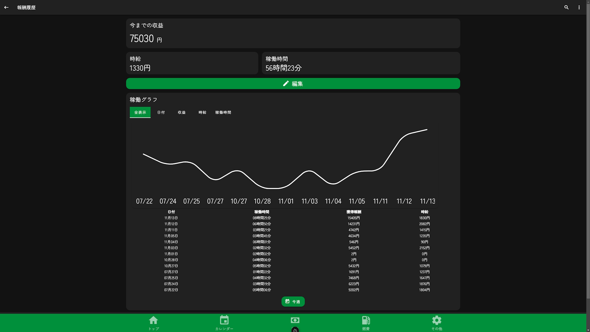

# Uber Utility

Uber Driverアプリをもっと楽しく使えるユーティリティ




## Our Mission

使いにくいUber Driverアプリに不足している機能を補う

## Included（予定を含む）

- 自動で時給計算
- 目標の稼働時間や報酬を設定し、目標稼働時間を表示
- カレンダー機能でいつ何円稼いだか表示
- 走行距離からざっくり燃費の計算
- 過去データや他配達員データからの分析とランキング

## 動作環境

- JavaScriptが動作する環境
- WPAでアプリとして利用可能
- Androidに限り、APKファイルで配布するかも

---

ここから下はテンプレートのREADMEです

---

## Nuxt3 Template

Nuxtを簡単にインストールしてすぐ使うためのテンプレート

- NOLICENSED ご自由にお使いください

## 前提

Node.jsとnpmとyarnくらい入ってるよね！（投げやり）
デプロイ先はVercelを想定してるけど多分どこでも動きます
あとPHPのcomposerも用意してね

## INCLUDED

- Vue CLI Service
- Vue3
- Vuetify3
- Vuetify ダークテーマ
- Nuxt3
- Vue-router
- VSCode、Git、Eslint、Prettier周りの設定ファイル
- PugとSASS
- PWA Preset
- Google Fonts
- Vue Content Loader

## 独自実装

- Cookie API
- Ajax API
- 画面を右スワイプでメニュー表示
- イイカンジにカスタマイズされたSCSSファイル
- コピペで使えるpugテンプレート
- 汎用性の高い関数群
- ダークテーマ切り替えボタン
- Push API（使いやすいように改良）
- Notification API（使いやすいように改良）
- アカウント登録時のメールアドレス認証、アクセストークンの発行
- MySQL用API

## 制作予定

- リッチエディタ

## 注意

ポート12345で動くようにしてあります  
VSCodeでの利用を推奨

~~Vue3慣れてなくてOptions API使ってるけど許して~~

## 参考資料

WebPush https://tech.excite.co.jp/entry/2021/06/30/104213

## Setup

このプログラムは、表示用サーバーと処理用サーバーの2つが必要です

### 表示用サーバー

```shell
git clone git@github.com:jikantoki/nuxt3temp.git
echo 'これだけでセットアップ完了！'
echo 'Vercelとかでデプロイしたらそのまま動く'
```

### WebPush用の鍵を作成

ここで作れます https://web-push-codelab.glitch.me/

#### ストレージを操作できる環境の場合

ルートに.envファイルを作成し、以下のように記述（クォーテーション不要）

```env
VUE_APP_WEBPUSH_PUBLICKEY=パブリックキーをコピー
VUE_APP_WEBPUSH_PRIVATEKEY=プライベートキーをコピー

VUE_APP_API_ID=default
VUE_APP_API_TOKEN=後のPHPで作成するアクセストークン
VUE_APP_API_ACCESSKEY=後のPHPで作成するアクセスキー

VUE_APP_API_HOST=APIサーバーのホスト
```

#### それ以外（Vercelデプロイ等）

Project Settings → Enviroment Variables を開く  
上記.envファイルと同じ感じで設定

### PHPサーバー（内部処理用）

サーバーサイドはPHPで開発しているため、一部処理を実行するにはPHPサーバーの用意が必要です  
とりあえずレンタルサーバーでも借りれば実行できます

1. API用のドメインをクライアント側（Vercel等）とは別で用意する
2. このリポジトリのphpフォルダをドメインのルートにする（.htaccess等で）
3. （準備中！！！）にAPI用のドメインを記述
4. リポジトリルート直下に/env.phpを用意し、以下の記述をする

```php
<?php
define('DIRECTORY_NAME', '/プロジェクトルートのディレクトリ名');

define('VUE_APP_WebPush_PublicKey', 'パブリックキー');
define('VUE_APP_WebPush_PrivateKey', 'プライベートキー');
define('WebPush_URL', 'プッシュ通知を使うドメイン');
define('WebPush_URL_dev', 'プッシュ通知を使うドメイン（開発用）');//この行は無くても良い
define('WebPush_icon', 'プッシュ通知がスマホに届いたときに表示するアイコンURL');
define('Default_user_icon', 'アイコン未設定アカウント用の初期アイコンURL');

define('MySQL_Host', 'MySQLサーバー');
define('MySQL_DBName', 'DB名');
define('MySQL_User', 'DB操作ユーザー名');
define('MySQL_Password', 'DBパスワード');

define('SMTP_Name', '自動メール送信時の差出名');
define('SMTP_Username', 'SMTPユーザー名');
define('SMTP_Mailaddress', '送信に使うメールアドレス');
define('SMTP_Password', 'SMTPパスワード');
define('SMTP_Server', 'SMTPサーバー');
define('SMTP_Port', 587); //基本は587を使えば大丈夫

```

#### PHPサーバー用の.htaccessの用意

大体こんな感じで設定する

```htaccess
#トップページを/nuxt3temp/php にする
<IfModule mod_rewrite.c>
RewriteEngine on
RewriteBase /
RewriteRule ^$ nuxt3temp/php/ [L]
RewriteCond %{REQUEST_FILENAME} !-f
RewriteCond %{REQUEST_FILENAME} !-d
RewriteRule ^(.+)$ nuxt3temp/php/$1 [L]
</IfModule>
# 外部からのAPIへのアクセスを許可
Header append Access-Control-Allow-Origin: "*"

```

### MySQLの用意

#### /database.sqlファイルをインポートする

PHPMyAdminが使える環境ならDB直下にインポートして終わり、コマンドラインでやる方法は知らん

#### ※インポートでエラーが出たら

/database_VIEW.sql の中身をコピーしてphpmyadminで直接実行

### デフォルトAPIのトークンを用意する

このプログラムは独自のアクセストークンを利用してAPIにアクセスします。  
そのため、初回APIを登録する作業が必要です。

1. セットアップしたAPI用サーバーの/makeApiForAdmin.phpにアクセス
2. 初回アクセス時のみMySQLで登録作業が行われるので、出てきた画面の内容をコピー
3. .envにｲｲｶﾝｼﾞに内容を記述（書き方はさっき説明した）
4. 以後、その値を使ってAPIを操作できます

**忘れたらリセット**するしかないので注意！（一部データは暗号化されており、管理者でも確認できません）

#### デフォルトAPIトークンのリセット方法

1. MySQLのapi_listテーブルのsecretId='default'を削除
2. api_listForViewのsecretId='default'も同様に削除
3. 初回登録と同じ感じでやる
4. データベースに再度defaultが追加されていることを確認

## コンソール側で初期化

```shell
yarn install
composer install #PHP用
```

### 実行

```shell
yarn run dev
```

### 設定方法

| 項目           | 設定箇所                     |
| -------------- | ---------------------------- |
| アプリ名       | /package.json                |
| フォント       | /layout/default.vue          |
| ナビゲーション | /items/itemNavigationList.js |
| 404ページ      | /error.vue                   |

### Compiles and minifies for production

```shell
yarn build
```

### Lints and fixes files

```shell
yarn lint
```

### Customize configuration

See [Configuration Reference](https://cli.vuejs.org/config/).

## トラブルシューティング

### PHPがおかしい

composerちゃんと入れた？
